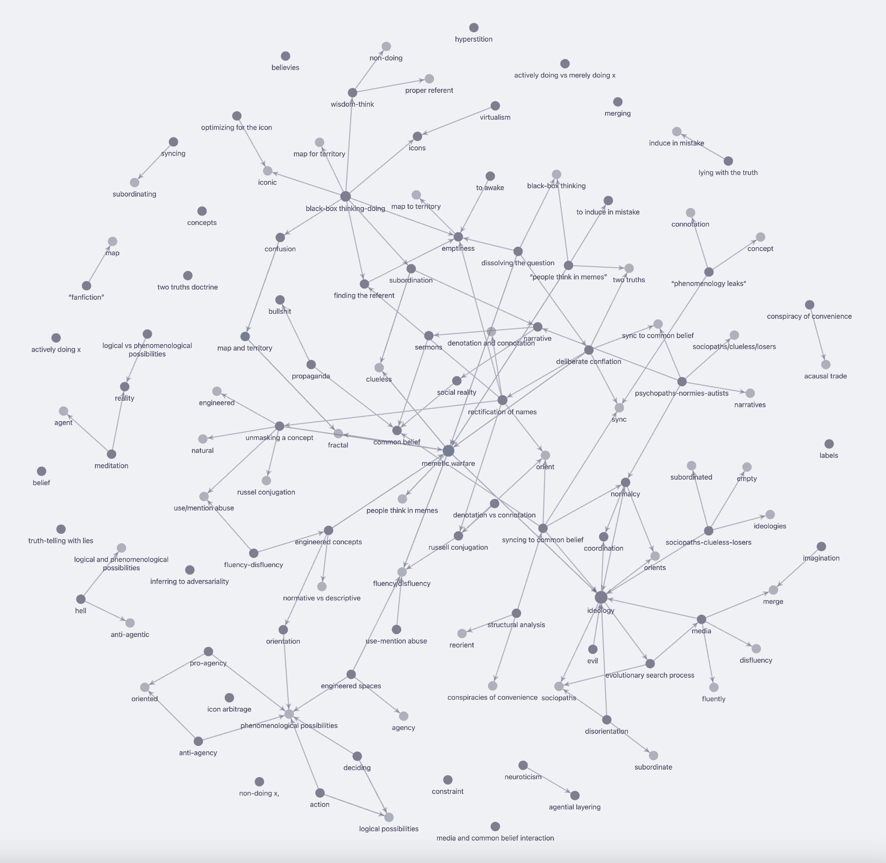

steps
1. download doc https://docs.google.com/document/d/1fkkVMmgMN19jTsKWdRwzMViv2yEO8ObO6zKb00yKuB8/edit as html zipped
2. run bash.sh
3. copy the content folder (nosilverv) to obsidian
4. copy images folder in ./data to your obsidian file folder

notes
- lowercase everything for obsidian link

